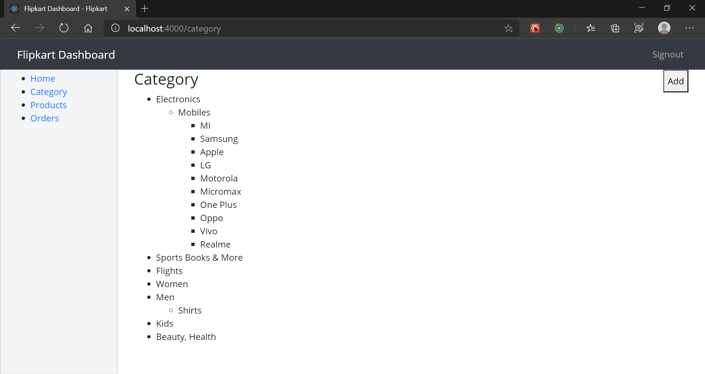
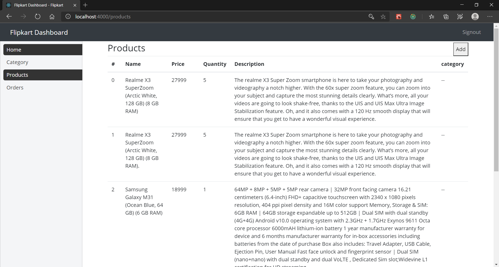
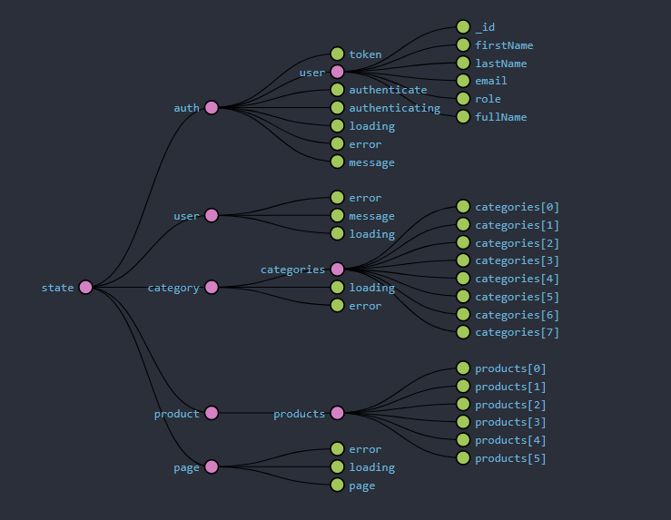

<h1> Flipkart Admin Dashboard </h1>

This is the Admin Dashboard for ecommerce website. It's being developed using **`React, Redux, Redux Thunk, Bootstrap, react-checkbox-tree, axios`** etc.

### Let's take a look at frontend and backend here at:

#### [Flipkart Clone (https://github.com/ravi3222/flipkart-clone)](https://github.com/ravi3222/flipkart-clone)

#### [Flipkart Clone Backend (https://github.com/ravi3222/flipkart-clone-backend)](https://github.com/ravi3222/flipkart-clone-backend)

<h2><i>Screenshots</i></h2>

### Application State

<h2>🚀 Some Tools I Use</h2>

<!--  -->

